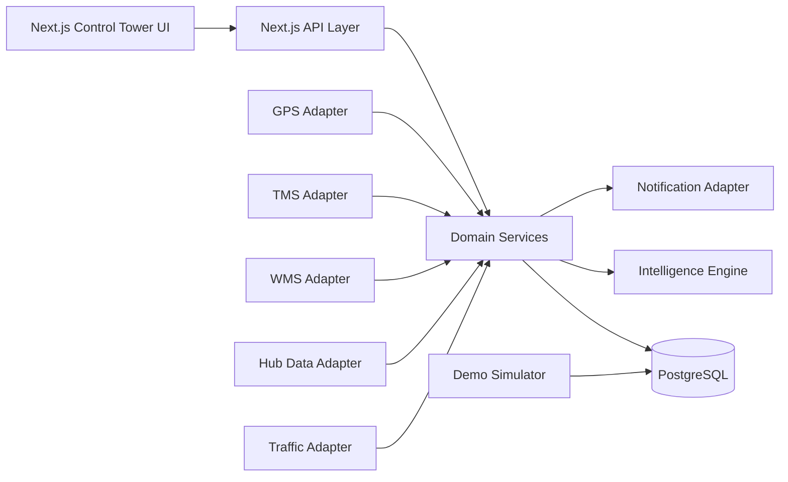

# 03 Architecture

## 1. Logical architecture



## 2. Architecture principle

Build the UI against domain services and normalized internal models.

Do not make the frontend aware of vendor-specific GPS/TMS/WMS payload shapes.

## 3. Adapter pattern

Each source should map into an internal contract.

Example:

```ts
interface GpsProvider {
  getLatestVehiclePositions(
    vehicleIds?: string[]
  ): Promise<VehiclePosition[]>;
}
```

The demo provider and the future real provider implement the same contract.

## 4. Domain boundaries

### Shipment domain
- lifecycle;
- ETA;
- status;
- customer;
- route.

### Fleet domain
- vehicle;
- driver metadata if approved;
- location;
- movement.

### Hub domain
- hub;
- arrival;
- departure;
- dwell.

### Intelligence domain
- ETA;
- risk;
- route deviation;
- exceptions.

### Notification domain
- channel;
- template;
- event;
- delivery state.

### Analytics domain
- KPI calculation;
- trends;
- drill-down.

## 5. Pages

```text
/
  -> redirect to /control-tower

/control-tower
/shipments
/shipments/[shipmentId]
/fleet
/hubs
/exceptions
/analytics
/customers/tracking/[trackingToken]
/settings/integrations
/settings/users
/settings/alerts
```

## 6. Layout

```text
AppShell
  ├── Sidebar
  ├── Topbar
  └── MainContent
       ├── KPI Strip
       ├── Filter Bar
       └── Page Content
```

## 7. State strategy

Server state:
- API/TanStack Query.

URL state:
- date range;
- filters;
- selected hub;
- selected status.

Local UI state:
- drawers;
- modals;
- temporary form inputs.

Do not put all application state into one global store.
