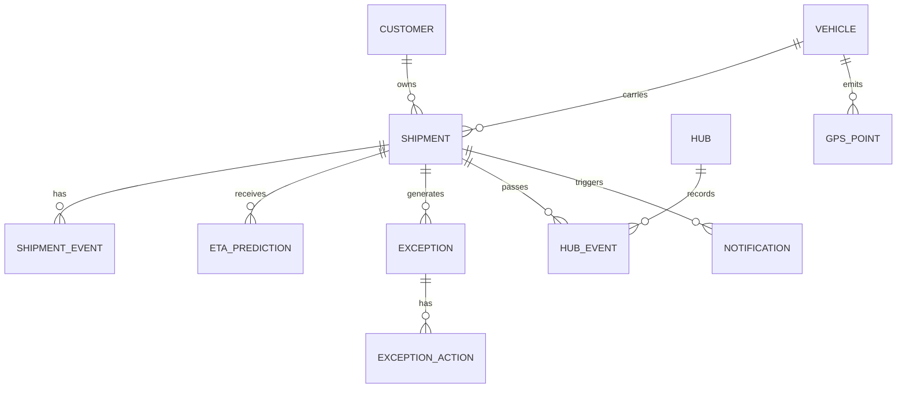

# 04 Data Model

## 1. Entity relationship



## 2. Shipment

```ts
type Shipment = {
  id: string;
  trackingNumber: string;
  customerId: string;
  origin: LocationRef;
  destination: LocationRef;
  vehicleId?: string;
  currentStatus: ShipmentStatus;
  priority: "STANDARD" | "EXPRESS" | "CRITICAL";
  bookingAt: string;
  promisedDeliveryAt: string;
  originalEtaAt?: string;
  revisedEtaAt?: string;
  deliveredAt?: string;
  currentLocation?: GeoPoint;
  nextHubId?: string;
  routeId?: string;
  delayMinutes: number;
  riskLevel: "LOW" | "MEDIUM" | "HIGH" | "CRITICAL";
  lastEventAt: string;
  dataFreshnessAt: string;
  publicTrackingToken: string;
};
```

## 3. Shipment status

```ts
enum ShipmentStatus {
  ORDER_BOOKED = "ORDER_BOOKED",
  PICKED_UP = "PICKED_UP",
  IN_TRANSIT = "IN_TRANSIT",
  HUB_REACHED = "HUB_REACHED",
  OUT_FOR_DELIVERY = "OUT_FOR_DELIVERY",
  DELIVERED = "DELIVERED"
}
```

## 4. Location

```ts
type LocationRef = {
  code?: string;
  name: string;
  city: string;
  state?: string;
  country: string;
  latitude: number;
  longitude: number;
};
```

## 5. GPS point

```ts
type GPSPoint = {
  id: string;
  vehicleId: string;
  latitude: number;
  longitude: number;
  speedKph?: number;
  headingDeg?: number;
  recordedAt: string;
  receivedAt: string;
  source: "DEMO" | "GPS_PROVIDER";
};
```

## 6. Hub event

```ts
type HubEvent = {
  id: string;
  shipmentId: string;
  hubId: string;
  arrivedAt?: string;
  departedAt?: string;
  dwellMinutes?: number;
  status: "ARRIVED" | "WAITING" | "PROCESSING" | "DEPARTED";
};
```

## 7. ETA prediction

```ts
type EtaPrediction = {
  id: string;
  shipmentId: string;
  predictedEtaAt: string;
  previousEtaAt?: string;
  generatedAt: string;
  delayMinutes: number;
  confidence: number;
  riskLevel: "LOW" | "MEDIUM" | "HIGH" | "CRITICAL";
  factors: EtaFactor[];
};
```

## 8. Exception

```ts
type Exception = {
  id: string;
  shipmentId: string;
  type:
    | "DELAY_RISK"
    | "HUB_DWELL"
    | "NO_MOVEMENT"
    | "ROUTE_DEVIATION"
    | "TRAFFIC"
    | "STALE_GPS"
    | "MISSED_MILESTONE";
  severity: "INFO" | "WARNING" | "HIGH" | "CRITICAL";
  title: string;
  description: string;
  detectedAt: string;
  status: "OPEN" | "IN_PROGRESS" | "RESOLVED" | "DISMISSED";
  assignedTo?: string;
  source?: string;
  metadata?: Record<string, unknown>;
};
```

## 9. Notification

```ts
type Notification = {
  id: string;
  shipmentId: string;
  customerId: string;
  channel: "WHATSAPP" | "SMS" | "EMAIL";
  template:
    | "SHIPMENT_UPDATE"
    | "DELAY_NOTICE"
    | "REVISED_ETA"
    | "TRACKING_LINK";
  recipientMasked: string;
  payload: Record<string, unknown>;
  status: "QUEUED" | "SENT" | "DELIVERED" | "FAILED";
  createdAt: string;
  sentAt?: string;
};
```

## 10. KPI snapshot

```ts
type KpiSnapshot = {
  date: string;
  etaAccuracy: number;
  otif: number;
  avgDelayResponseMinutes: number;
  customerQueries: number;
  avgHubDwellMinutes: number;
  routeExceptions: number;
};
```
